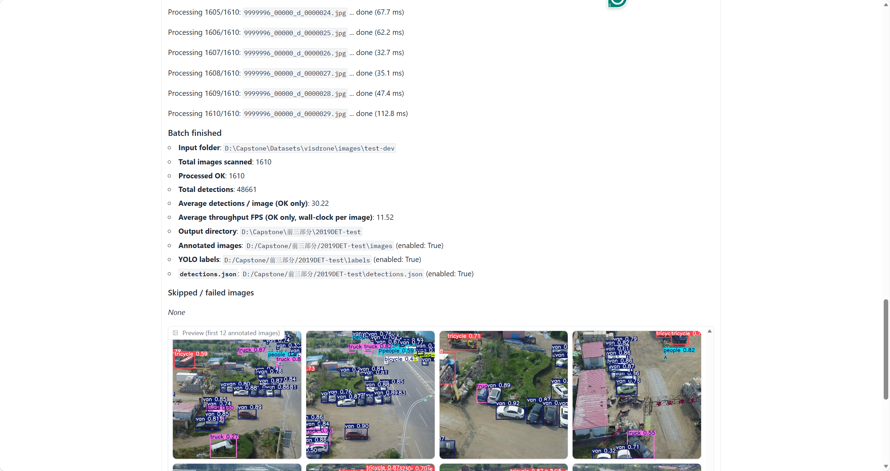

# Lightweight YOLOv8s-SEA for UAV Small Object Detection

This repository provides the implementation of a lightweight **YOLOv8s-SEA model with Knowledge Distillation (KD)** for UAV small object detection based on the VisDrone dataset.

---

## Project Structure

Custom work in this repository is concentrated in two places:

* **Model configuration (YAML)** — under the vendored Ultralytics tree at `Code/ultralytics/ultralytics/cfg/models/v8/`. This directory holds YOLOv8 architecture definitions, including the lightweight variants used in this project (e.g., Ghost-style backbone blocks, ECA attention, AFPN-style fusion). Proposed and ablation layouts for this work are kept under the `fusion/` subfolder (for example, `yolov8s_sg_eca_afpn_improve.yaml`).

* **Custom module implementations** — building blocks referenced by those YAML files are implemented in `block.py`:
  * At the repository root: `ultralytics/nn/modules/block.py` (top-level `ultralytics/` package, alongside the `Code/` directory).
  * A corresponding copy also exists inside the vendored fork at `Code/ultralytics/ultralytics/nn/modules/block.py`. When training with the in-repo `Code/ultralytics` sources, ensure the `block.py` you edit matches the configuration you load so definitions stay consistent.

Training scripts, dataset YAML, and the Gradio demo live under `Code/` at the paths referenced in later sections.

---

## 1. Environment Setup

The experiments were conducted using the following environment:

* OS: Windows 10
* Python: 3.8
* PyTorch: 2.4.1 + CUDA 11.8
* GPU: NVIDIA GeForce RTX 3060 Laptop GPU

Create and activate the conda environment:

```
conda create -n yolov8_sea python=3.8
conda activate yolov8_sea
```

Install PyTorch:

```
pip install torch torchvision torchaudio --index-url https://download.pytorch.org/whl/cu118
```

Install YOLOv8:

```
pip install ultralytics
```

---

## 2. Dataset

The experiments are conducted on the **VisDrone2019 dataset**, which is widely used for UAV-based object detection.

Dataset source:
https://github.com/VisDrone/VisDrone-Dataset

For faster experimentation, a **mini version of the dataset** is generated using the provided script.

Run the following script:

```
python Code/make_mini_visdrone.py
```

This script creates a reduced version of the VisDrone dataset for faster training and ablation experiments.

---

## 3. Baseline Training

The baseline **YOLOv8s** model can be trained using the following command:

```
yolo train model=yolov8s.pt data=Code/visdrone.yaml epochs=100 imgsz=640 batch=6 device=0 half=True verbose=True
```

This configuration follows the standard YOLOv8 training setup and serves as the baseline model.

---

## 4. Training the Proposed Model

The final model with **SEA attention module and knowledge distillation** is trained using the following script:

```
python Code/train_distill_full.py
```

This script implements the training pipeline for the proposed lightweight YOLOv8s-SEA model.

---

## 5. Model Evaluation

After training, the model can be evaluated using the YOLOv8 validation command:

```
yolo val model=runs/detect/sea_full_distill_v1/weights/best.pt
```

The evaluation reports the following metrics:

* mAP50
* mAP50-95
* Precision
* Recall
* FPS

These metrics are used to compare the baseline YOLOv8s model and the proposed YOLOv8s-SEA model.

---

## 6. Reproducibility

The script `Generate_env.py` is included to export the environment configuration and assist in reproducing the experimental setup.

---
## 7. Web Demo Interface

A Gradio-based web demo is provided for interactive testing of the trained model. The screenshot below shows the testing GUI:

<p align="center">
  
  <br>
  <em>Figure: Web demo interface for UAV small object detection.</em>
</p>
